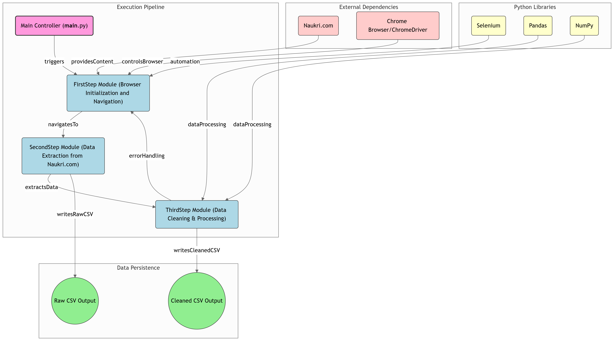

# Lead Generation Job Scraper

An automated web scraping tool that extracts, processes, and analyzes lead generation job listings from Naukri.com. This project implements a robust scraping pipeline with built-in data cleaning and processing capabilities.


## Features

- 🤖 Automated web scraping of Naukri.com job listings
- 📊 Systematic data collection of lead generation positions
- 🧹 Built-in data cleaning and deduplication
- ⏱️ Smart waiting mechanisms to prevent rate limiting
- 📁 CSV export functionality
- 🔄 Resumable data collection

### Time-Saving Features:

- Resume capability: Checks for existing data before starting
- Batch processing: Handles 20 jobs simultaneously
- Smart waits: Implements variable delays based on context
- Efficient selectors: Uses optimized CSS selectors for faster element location
- Error recovery: Automatically handles and recovers from common issues

## Project Structure

```project/
├── backend/
│   ├── firstStep.py  - Initial setup and search execution
│   ├── secondStep.py - Data extraction and collection
│   └── thirdStep.py  - Data cleaning and processing
└── __main__.py      - Main execution script
```

## Prerequisites

- Python 3.7+
- Chrome browser installed
- ChromeDriver matching your Chrome version
- Pandas
- NumPy

```bash
  pip install selenium pandas numpy
```


## Examples

### Usage
1. Clone the repository:
```
git clone https://github.com/XenosWarlocks/super-duper-engine.git
cd super-duper-engine
```

2. Run the script:
```
python __main__.py
```

## Workflow

## Output
The script will:

1. Initialize Chrome WebDriver
2. Navigate to Naukri.com
3. Search for lead generation positions
4. Extract job details from multiple pages
5. Clean and process the collected data
6. Save results to CSV files

## Data Collection Process
### First Step (`firstStep.py`)

- Initializes Chrome WebDriver with custom options
- Handles page navigation and search execution
- Implements smart waiting mechanisms for page loads

### Second Step (`secondStep.py`)

- Extracts job details from search results
- Collects data from multiple pages (up to 20)
- Implements random waiting periods between requests
- Saves raw data to CSV

### Third Step (`thirdStep.py`)

- Reads and processes the collected data
- Removes outdated job postings (30+ days old)
- Eliminates duplicate entries
- Exports cleaned data to a new CSV file


The tool generates a CSV file containing:

- Job ID
- Job Title
- Company Name
- Company URL
- Posted Time
- Page Number

## Error Handling
The script includes comprehensive error handling for:

- Network issues
- Page load timeouts
- Missing elements
- Data processing errors


## Key Classes and Methods
### LinkedInValidator

- `__init__()`: Initializes the validator and GUI components
- `validate_csv_file()`: Handles CSV file selection and validation
- `verify_profiles()`: Performs the profile verification process
- `save_updates()`: Generates the output report
- `cleanup()`: Handles resource cleanup

## Best Practices

- Rate Limiting: Add delays between profile checks to avoid - LinkedIn's rate limits
- Error Handling: Enable debug mode when troubleshooting issues
- Data Privacy: Never commit LinkedIn credentials to version control
- CSV Backup: Keep backups of your input CSV files
